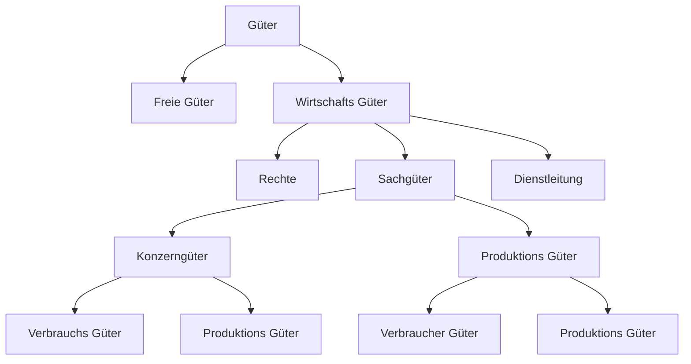

---
tags:
  - WISO
  - Wirtschaft
  - BGP
---
# Wirtschaftszweige
## Sektoren
### Primärer Sektor
Der Primäre Sektor sind Industrien die Rohstoffe oder Grund Resourcen, wie Essen, Produzieren. Zum Beispiel: Fischerein, Bauern, Bergbau
### Sekundärer Sektor
Diese sind die Industrien welche Die Rohstoffe weiter entwickeln,  z.B Sägewerke

### Tertiärer Sektor
Sind die Unternehmen die Dienstleistungen oder im Handelsbetrieb sind, zum Beispiel Banken und Handel betriebe.

### Quartären Sektor
Das sind die Information und Telekommunikation Unternehmen.

## Marktformen
Die Marktformen beschreiben den aufbau eines Marktes.

### Unternehmens zusammenschlüssel
#### Arbeitsgemeinschaft
Vertraglich Rechtlich Zusammenarbeit mehrerer Betriebe, zwecke eines spezifischen Ziel. 
Bsp.: Bauprojekte
Zum Beispiel ein Bauprojekt.

#### Joint Ventures
Wenn zwei oder mehr Unternehmen von sich Unabhängige unternehem gemeinsam an einem Ziel dessen beider intresse arbeiten. 
Bsp.: BMW und Toyota für Brennstoffzellen

#### Kartell
Sind Zusammenschlüsse mehrere unabhängige Unternehmen

#### Konzern

### Güter

