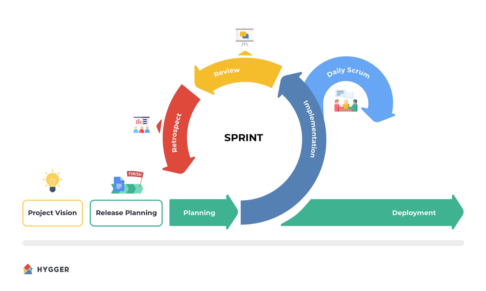

# Agile
## Leitsätze
1. Individuen und Interaktionen sind wichtiger als Prozesse und Werkzeuge
2. Funktionierende Software ist wichtiger als Dokumentation
3. Zusammenarbeit mit Kunden is wichtiger als Vertragsverhandlungen
4. Reagieren bei Veränderung statt Plan stur zu verfolgen

## SCRUM

### Rollen
- **Produkt Owner**
	- Person, die für die Priorisierung der Aufgaben (im Vorhinein) zuständig ist (verantwortlich für Product Backlog)
	- Trifft Entscheidungen über Auslieferung, Inhalt, Qualität des Produkts an den Kunden
	- Steht in Verbindung mit em Kunden (Stackeholder) + vertritt deren Interesse
- **Entwicklungsteam**
	- Experten in ihrem Fachgebiet, die zusammen als Team für den Erfolg des Projekts arbeiten
	- Ca. 3-10 Personen je Team
	- Jeder im Team hat unterschiedlich
- **SCRUM Master**
	- Unterstützt bzw. leitet das Team, versucht Prozesse kontinuierlich zu verbessern + Zusammenarbeit zu fördern
	- Beseitigen von Hindernissen im Team oder auch fachlich
	- Sicherstellung der Einhalten von Prozessen und Prinzipien 
### Ereignisse
- **Sprint**
	- Fester Zeitraum, indem eine Teilaufgabe eines Projektes ausgeführt wird
	- 1 - 4 Wochen Dauer
- **Sprint Planning**
	- Plannungstreffen, bei dem die Aufgaben für die nächsten Sprint festgelegt werden (Zerlegung eines Inkrementes in viele kleine Teilaufgaben)
	- Zu Beginn jedes Sprints
- **Daily Scrum**
	- Tagtäglich Meetings (möglichst kurz gehalten)
	- Fortschritt der Aufgaben, was wurde Erledigt, was steht als nächstes an, was könnte an Probleme auftreten (ist aufgetreten)
- **Sprint Review**
	- Treffen am ended eines Sprints
	- Rückblick auf den letzten Sprint, vorstellung der Zwischen Ergebnisse (fachliches Feedback)
	- Ergebnis wird dem P.O. vorgestellt
- **Sprint Retrospektive**
	- Treffen am Ende eines Sprints
	- Wird vom Scrum Master geleitet
	- Feedback zu Zusammenarbeit, Methoden, Kritik and Kollegen
### Artefakte
- **Product Backlog**
	- Liste aller Aufgaben, die inem Projet abzuarbeiten sind
	- Aufgaben werden priorisiert und mit Arbeitsaufwand geschätzt
- **Sprint Backlog**
	- List aller Aufgaben, die im Sprint zu erledigen sind.
	- Aufteilung in "To-Do,", "Doing", "Done" (Qualitätssicherung)
	- Hilft bei der Übersichtlichkeit und Transperent der zu erledigen Aufgaben
- **Inkrement**
	- Überbegriff für Zwischenprodukt
	- Zwischenprodukt sollte für sich funktionsfähig sein
